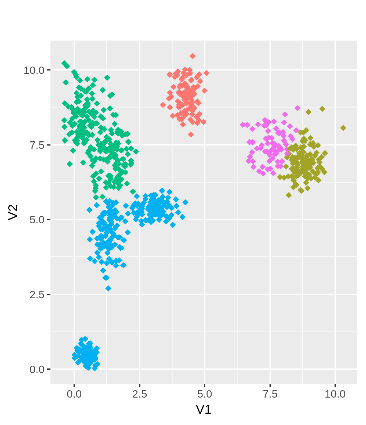
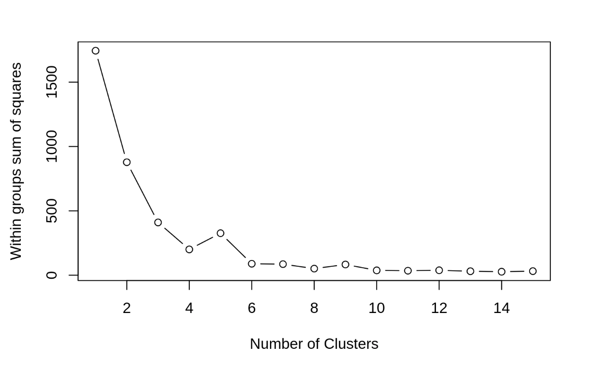

# KMEANS-CLUSTERING-FROM-SCRATCH-IN-R

**Project Content:**

The aimed of this project was to better understand Kmeans clustering by creating an algorithm by scratch without using 
built in functions in R. The algorithm utilized fake data to focus on the structure of the algorithm. Currently, this 
code is written for only 4 clusters within a dataset but could easily be manipulated to be less clusters. 
The code is directly from R Studio.

**Image: Plots of Clusters** 

**Image: Elbow Method**

